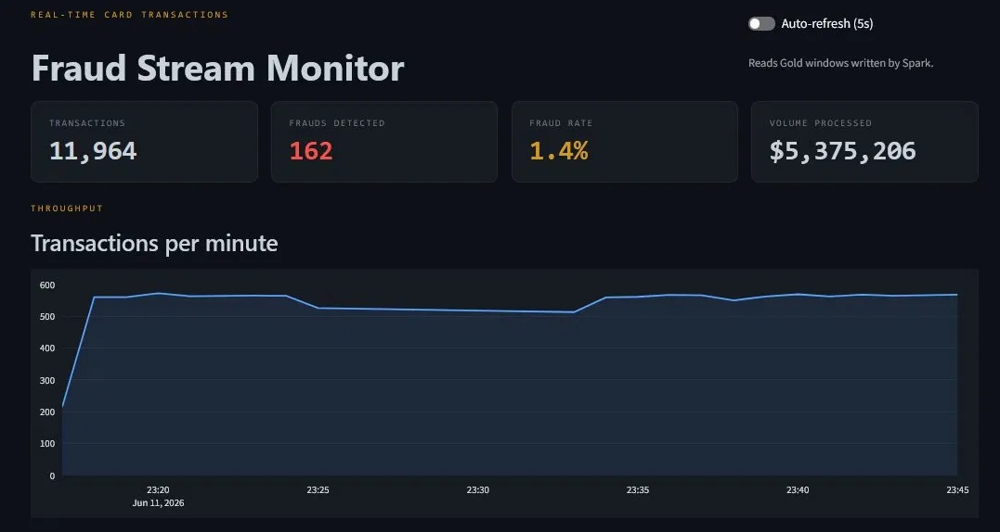
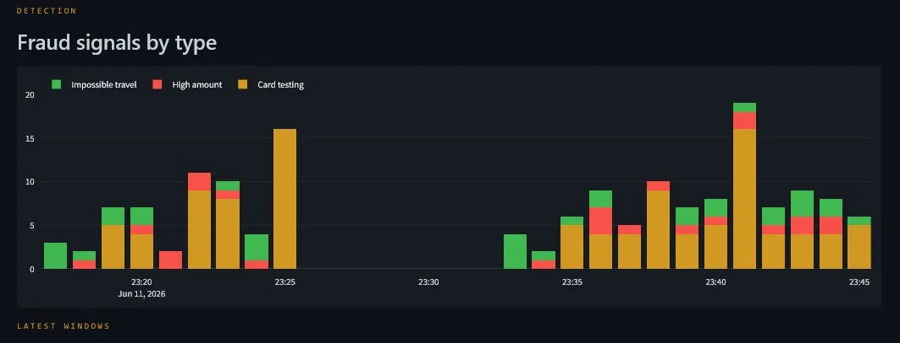
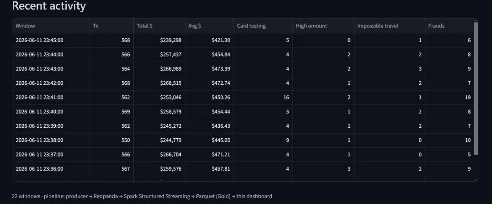
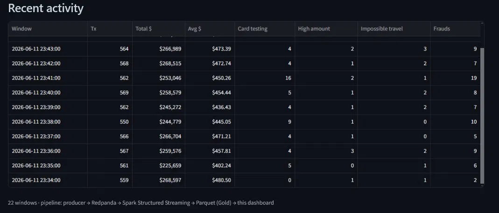
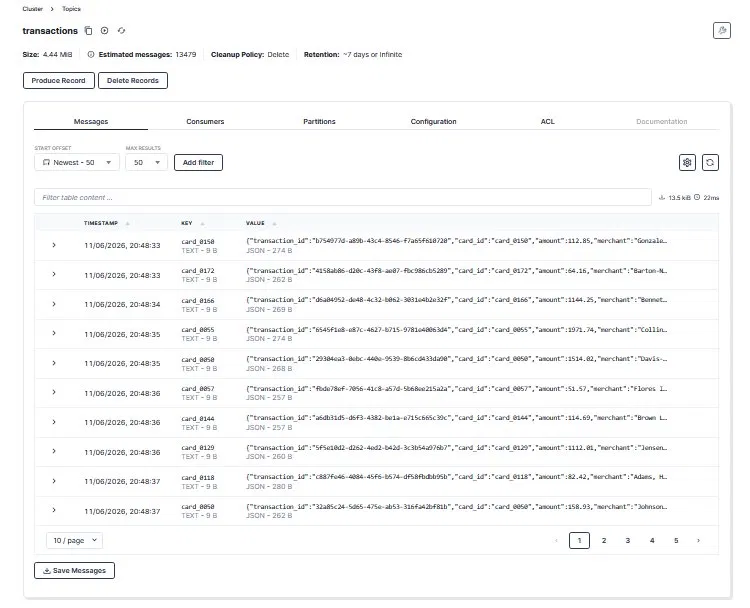
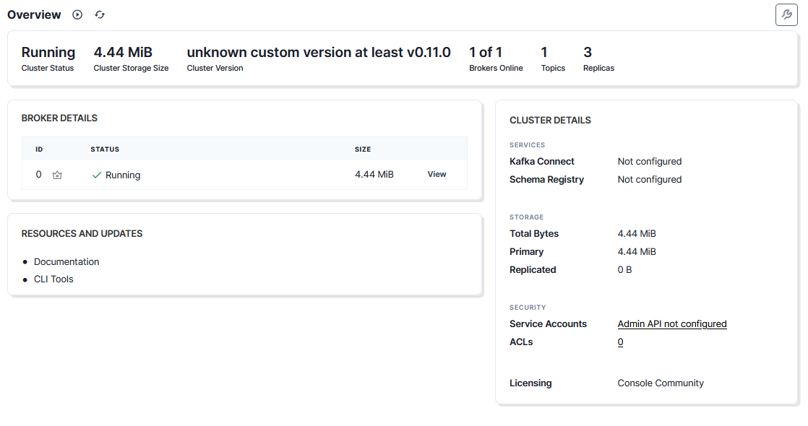

# Real-Time Fraud Stream Monitor

A real-time streaming data pipeline that detects credit-card fraud patterns as transactions happen. Synthetic card transactions are produced to **Redpanda** (Kafka API), processed by **Spark Structured Streaming** with windowed aggregations and watermarking, persisted to a layered **Parquet** store, and surfaced on a live **Streamlit** dashboard.

- **Live dashboard:** https://realtime-fraud-streaming.streamlit.app
- **Repo:** github.com/DiegoTDDD/realtime-fraud-streaming

---

## Skills demonstrated

- **Stream processing** — Spark Structured Streaming with tumbling windows and event-time watermarking to handle late, out-of-order events
- **Event streaming** — Redpanda (Kafka API): topic design, partitioning by key, message inspection
- **Data modeling** — medallion Bronze/Gold layering applied to a streaming source
- **Containerization** — Docker Compose for the broker and console
- **Pipeline design** — decoupled producer / broker / processor / storage / dashboard, each independently runnable
- **Data visualization** — a purpose-built live monitoring dashboard with alerting
- **Domain framing** — fraud patterns modeled the way real detection systems categorize them, with ground-truth labels for downstream ML

---

## Why this project

Fraud detection is the canonical real-time data problem: events arrive continuously, fraud is rare, and the signal lives in temporal patterns rather than any single transaction. This project builds the full streaming backbone end to end on a local machine, with no cloud dependency, and is designed to be the foundation for an applied real-time fraud-detection model.

---

## Architecture

```
┌────────────┐     ┌────────────┐     ┌─────────────────────┐     ┌──────────────┐     ┌─────────────┐
│  Producer  │     │  Redpanda  │     │  Spark Structured   │     │   Parquet    │     │  Streamlit  │
│  (Python)  │ ──▶ │ (Kafka API)│ ──▶ │  Streaming          │ ──▶ │  Bronze/Gold │ ──▶ │  Dashboard  │
│            │     │            │     │                     │     │              │     │             │
│ card txns  │     │  topic:    │     │ windowed aggs +     │     │  layered     │     │ live KPIs + │
│ + injected │     │ transactions│    │ watermarking        │     │  storage     │     │ alerts      │
│ fraud      │     │ 3 partitions│    │                     │     │              │     │             │
└────────────┘     └────────────┘     └─────────────────────┘     └──────────────┘     └─────────────┘
```

**Producer** emits ~10 transactions/second (~600/minute). Each event carries a card id, amount, merchant, category, city, and timestamp. About 1.5% are injected frauds across three classic patterns, each tagged with a ground-truth label for downstream model training.

**Redpanda** is a Kafka-API-compatible broker running as a single container (no ZooKeeper). Events land on the `transactions` topic, keyed by card id so all activity for a card preserves order within a partition.

**Spark Structured Streaming** consumes the topic and runs two queries: a Bronze query that persists every raw transaction, and a Gold query that computes 1-minute tumbling-window aggregations with a 2-minute watermark to tolerate late events.

**Parquet (Bronze/Gold)** mirrors a medallion layout: Bronze is the faithful landing zone (the training source for a future model), Gold holds the per-window aggregates the dashboard reads.

**Streamlit dashboard** reads Gold and renders headline counters, a throughput timeline, a per-type fraud breakdown, and a recent-windows alert table.

---

## The three fraud patterns

| Pattern | Behavior | How it shows up |
|---|---|---|
| **High amount** | A single charge far above the category norm | Spikes in the high-amount series |
| **Card testing** | A burst of small "probe" charges on one card in seconds | Clusters in the card-testing series; the dominant pattern by volume |
| **Impossible travel** | The same card transacting in distant cities minutes apart | Steady low-rate background in the impossible-travel series |

Card testing arrives in bursts, so it dominates the per-minute fraud counts even though high-amount and impossible-travel are seeded at similar base rates. The dashboard's stacked fraud chart makes this behavior visible at a glance.

---

## Tech stack

- **Streaming broker:** Redpanda (Kafka API), via Docker Compose
- **Stream processing:** Spark Structured Streaming (PySpark 3.5)
- **Storage:** Parquet, Bronze/Gold layers
- **Producer:** Python, confluent-kafka, Faker
- **Dashboard:** Streamlit + Plotly
- **Runtime:** Python 3.11 (conda), Java 17, Windows + Git Bash

---

## Dashboard

### Overview & throughput


### Fraud signals by type


### Recent activity & alerts



### Redpanda Console — live messages



---

## Running it locally

### Prerequisites

- **Docker Desktop** (with WSL 2 enabled on Windows)
- **Python 3.11** — a conda environment is recommended
- **Java 17** — Spark runs on the JVM. Java 8 causes compatibility issues; install Java 17 isolated in the conda env:
  ```bash
  conda install -c conda-forge openjdk=17 -y
  ```
- **Windows only — Hadoop native binaries.** Spark needs `winutils.exe` and `hadoop.dll` to write files on Windows. Place both in `C:\hadoop\bin` (downloadable from the community `cdarlint/winutils` repo, version 3.3.x). The streaming job points `HADOOP_HOME` there automatically.

### Steps

1. **Create and activate the environment**
   ```bash
   conda create -n fraud python=3.11 -y
   conda activate fraud
   ```

2. **Install dependencies**
   ```bash
   pip install -r requirements.txt
   ```

3. **Start Redpanda**
   ```bash
   docker compose up -d
   docker exec -it redpanda rpk topic create transactions -p 3
   ```

4. **Start the Spark streaming job** (terminal 1)
   ```bash
   python spark/streaming_job.py
   ```

5. **Start the producer** (terminal 2)
   ```bash
   python producer/producer.py
   ```

6. **Launch the dashboard** (terminal 3)
   ```bash
   streamlit run dashboard/app.py
   ```

Open `http://localhost:8501` for the dashboard and `http://localhost:8080` for the Redpanda Console.

---

## Project layout

```
realtime-fraud-streaming/
├── docker-compose.yml        # Redpanda + Console
├── producer/
│   └── producer.py           # transaction generator with injected fraud
├── spark/
│   ├── streaming_job.py      # Spark Structured Streaming: Bronze + Gold
│   └── export_sample.py      # consolidates Gold into a deploy sample
├── dashboard/
│   ├── app.py                # Streamlit live dashboard
│   └── requirements.txt      # lightweight deps for the deployed dashboard
├── data/
│   ├── bronze/               # raw transactions (gitignored)
│   ├── gold/                 # windowed aggregates (gitignored)
│   └── gold_sample/          # small sample for the deployed dashboard
├── docs/screenshots/
├── requirements.txt          # full local pipeline dependencies
└── .gitignore
```

---

## Notes on the data

The transaction stream is synthetic and generated locally. Fraud labels are injected deliberately so the same dataset can later train and evaluate a supervised model. The deployed dashboard reads a small consolidated sample of Gold windows; the full pipeline regenerates unlimited data on demand.

## Roadmap

This pipeline is the streaming foundation for an applied real-time fraud-detection model: a low-latency classifier scoring the same stream, handling severe class imbalance, and raising alerts — turning the descriptive monitor here into a predictive one.
